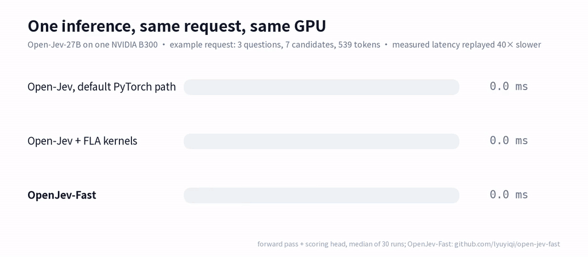
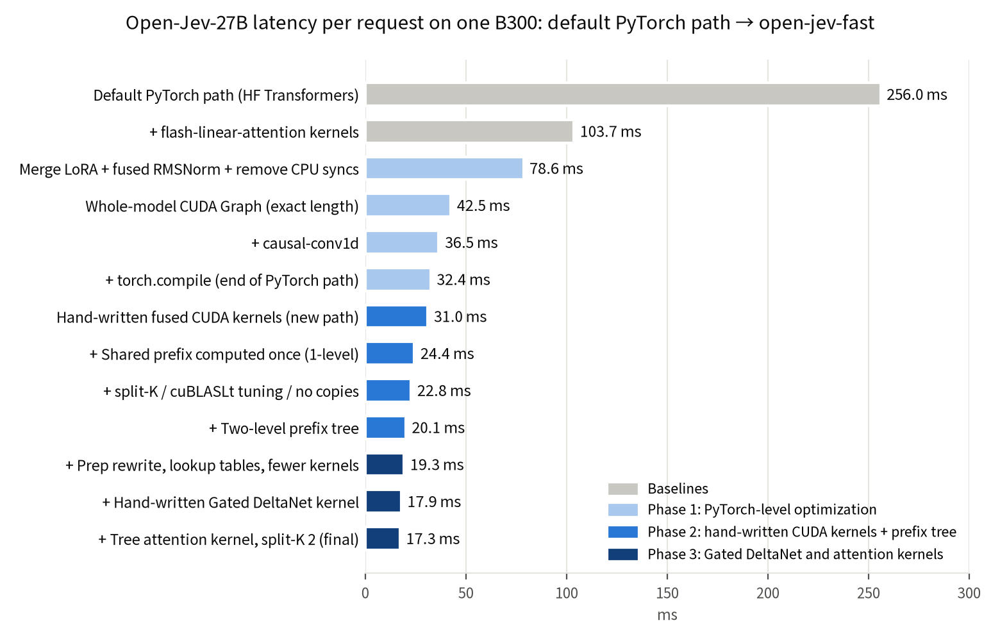

# OpenJev-Fast: 6× Faster Open-Jev-27B Inference with Specialized CUDA Kernels

**Report:** [web page](https://yiqilyu.me/open-jev-fast/) · [PDF](docs/report.pdf)



**A faster inference backend for [Open-Jev](https://github.com/Zefan-Cai/Open-Jev).** It runs locally as a drop-in replacement for Open-Jev's own local server (`python -m jev.server`, same request format), with the same model ([Open-Jev-27B-v1.1](https://huggingface.co/ZefanCai/Open-Jev-27B-v1.1) on [Qwen3.8-27B](https://huggingface.co/Qwen/Qwen3.8-27B)), in bf16 with no quantization. It replaces the model forward pass with hand-written CUDA kernels (including its own Gated DeltaNet and tree-attention kernels), a prefix tree that computes shared prompt text once, tuned matrix multiplies and CUDA Graphs.

Open-Jev is by the Open-Jev contributors; this repository runs on top of it and needs an Open-Jev installation and the model weights. **Built on:** Open-Jev [1], Open-Jev-27B-v1.1 / Qwen3.8-27B [2, 3], flash-linear-attention [4], Hugging Face Transformers [7], PEFT [8], PyTorch [9]; evaluated with JevBench [11]. What is used from each project is listed in [THIRD_PARTY_NOTICES.md](THIRD_PARTY_NOTICES.md).

## Results (1× NVIDIA B300, bf16)

| | Open-Jev, default PyTorch path | Open-Jev + FLA kernels | open-jev-fast |
|---|---|---|---|
| Example request, one inference (3 questions, 7 candidates, 539 tokens; forward pass + scoring head) | 256.0 ms | 103.7 ms | **17.3 ms** (14.8× / 6.0×) |
| JevBench, mean per-task latency (231 tasks, HTTP, concurrency 1) | — | 258 ms | **42.0 ms** (6.1×) |
| JevBench P50 / P95 / max | — | 150 / 802 / 1489 ms | **17.4 / 137 / 208 ms** |
| JevBench accuracy (our runs) | — | 198/231 | 197/231 (one near-tie prediction changed, see below) |

Open-Jev's default install does not include flash-linear-attention (FLA) [4], so Transformers runs the linear-attention layers as plain PyTorch ops: that is the first column. The second column is Open-Jev with FLA installed, which is also what our JevBench baseline server used.



*Example request: 3 questions, 7 candidates, 539 tokens. Median latency of the forward pass plus scoring head.*

The Open-Jev-27B-v1.1 model card reports 197/231 on public JevBench for this checkpoint; our runs of the original server scored 198/231.

## Test conditions

**Single inference (example request).**
- Request: Open-Jev's `configs/example-request.json`, a customer-service conversation with 3 questions (routing, 1 of 3; refund review, yes/no; urgency, 3 levels). That is 7 candidate prompts and 539 tokens.
- The three headline numbers (256.0 / 103.7 / 17.3 ms) come from one script, `bench/e2e_bench.py`, run one after another on the same GPU.
  - Each call times the forward pass over all 64 layers plus the scoring head. The prompts are built, tokenized and copied to the GPU once beforehand. For open-jev-fast, the call is the CUDA Graph replay. HTTP is not included.
  - Nothing is reused across requests. Shared prefixes are computed once only within a request.
  - 5 warm-up calls, then the median of 30, with `torch.cuda.synchronize()` before and after each ([`bench/logs/e2e_bench.log`](bench/logs/e2e_bench.log); values in [`results/e2e_latency.json`](results/e2e_latency.json)).
- The intermediate steps in the chart were measured during development. The 78.6 ms and 42.5 ms steps include prompt building and tokenization (about 1–2 ms); the others do not.

**JevBench.**
- The 231 public tasks at upstream `f8ce713`, run once in order at concurrency 1.
- Latency is client-side, as recorded by JevBench's own `TypeSafeAdapter`: tokenization, HTTP and JSON included, with a new connection per task. The client runs on the same machine as the server, for both servers.
- Optimized numbers are from a second pass, after the CUDA Graphs for the needed shapes were captured. Scoring uses JevBench's `score_task`.
- Both the original `jev.server` and this server ran with `--max-length 16384`, so that every JevBench task fits. The model card's saved limit is 4,096 tokens per candidate.
- Both servers are measured on their second pass: ours with the CUDA Graphs for the needed shapes captured, the original with its FLA Triton kernels compiled. The original runs as in a standard install (FLA; causal-conv1d, which phase 1 installed into our environment, is not used).
- On a first pass after start, with an empty Triton cache, the original compiles FLA's Triton kernels for each new shape: mean 1967 ms per task, P50 161 ms, slowest 65 s. Ours on its first pass, which captures a CUDA Graph for each new shape: mean 190 ms, P50 24.4 ms, slowest 3.3 s ([`results/summary.json`](results/summary.json)). The earlier published comparison (original mean 703 ms) used a first pass of the original.
- Server-side inference alone (tokenization, layout, forward) has a P50 of 15.0 ms.
- Earlier versions in `results/` (phase 1, service v1 and v3) were measured with the client on another machine of the cluster, which adds about 25 ms per task through the new connection; see [`results/summary.json`](results/summary.json).

Per-task results for every version are in [`results/`](results/) (task ID, prediction, correctness, latency); [`results/summary.json`](results/summary.json) has the aggregates.

## How it works

Without FLA, the Gated DeltaNet layers run as many small PyTorch ops (256 ms). With FLA, the original is **CPU-bound**: each request launches about 5000 small GPU kernels, and the GPU is busy for only about 51 of its ~103 ms. The seven candidate prompts also repeat most of their text.

**Phase 1, PyTorch level (103 → 32.4 ms).**
- Merge the LoRA adapter into the base weights.
- Fuse RMSNorm.
- Remove two CPU synchronizations in the Transformers mask code (`src/graph_patches.py`; both are "skip the mask if there is no padding" shortcuts, so the math is unchanged).
- Capture the whole model as one CUDA Graph at the exact length.
- Use the causal-conv1d kernel [6] and `torch.compile`.

**Phase 2, hand-written CUDA (32.4 → 20.1 ms).** This path replaces the phase-1 path. (Phase 3 below replaces the Gated DeltaNet core and, for trees up to 384 rows, full attention.)
1. **Six fused kernels** (`src/kernels.cu`) take over every non-matmul operation in a layer:
   - residual add + RMSNorm
   - SiLU·mul
   - Gated DeltaNet input prep: causal conv, SiLU, q/k/v split, head expansion, L2 norm, gate parameters
   - gated RMSNorm
   - full-attention prep: QK norm, partial RoPE, layout
   - sigmoid-gate multiply

   Matrix multiplies are merged from 9 to 4 per layer, and kernels per request drop from about 5000 to 945. Each kernel reproduces the bf16 rounding points of the Transformers reference [7] and FLA [4]. In phase 2 the Gated DeltaNet core was still FLA's `chunk_gated_delta_rule` [4, 5] and full attention was PyTorch SDPA.
2. **Prefix tree** (`src/fastmodel.py`: `gtree_build`, `forward_gtree`). One packed forward pass computes the shared context once, each question's text once, and each candidate's tail, so the weights are read once. For the example request, computed rows go from 574 to 277.
   - Linear-attention layers run each candidate over its complete path in a replicated layout, so the convolution window and recurrent state match the original.
   - Full-attention layers use an ancestor mask.
   - Long single-question prompts hand the prefix's final recurrent state to each candidate instead.

   Related ideas: shared-prefix attention [12, 13] and tree attention masks [14, 15].
3. **Matrix multiplies** (`src/lt.cpp`):
   - split-K with fp32 partial sums, reduced inside the RMSNorm kernel
   - every cuBLASLt heuristic algorithm timed per exact shape, keeping the fastest
   - the replication copies removed
4. **Serving** (`src/server.py`):
   - CUDA Graphs cached per (row bucket, candidates, path-length bucket), up to 512
   - buffered access log
   - `TCP_NODELAY`

**Phase 3, hand-written kernels for the remaining hot spots (20.1 → 17.3 ms).**
1. **Gated DeltaNet kernel** (`gdn_fused6_k` / `gdn_fused4_k` in `src/kernels.cu`) replaces FLA's `chunk_gated_delta_rule` on the prefix-tree path: 74 µs → 36.5 µs per layer.
   - One thread block per (candidate path, value head) runs the whole chunked recurrence: gate cumsum, K·Kᵀ, the (I + A)⁻¹ solve, u and w, the chunk output and the state update.
   - Matrix products use `mma.sync` (bf16 in, fp32 accumulate) with `ldmatrix`, and tiles arrive by `cp.async`, all as inline PTX. The fp32 state stays in registers. The 64×64 inverse follows FLA's block order with tf32 MMAs, and every bf16 rounding point of FLA [4, 5] is kept.
   - The cost is per 64-token chunk, not per token. For paths of 65–96 tokens (90 of the 231 JevBench tasks), the work that does not depend on the recurrent state runs for both chunks side by side, and only the state is passed in sequence. The output is bit-identical to the plain two-chunk version.
2. **Tree attention kernel** (`fattn_k`) replaces SDPA and the separate gate multiply when the tree has at most 384 rows: 21.4 µs → 12.7 µs per layer.
   - The ancestor mask arrives as bits, and 32-key blocks that no query row of a thread block can see are skipped.
   - Softmax is computed online, FlashAttention-2 style [19], and the sigmoid gate is applied to the output.
   - Larger trees keep cuDNN SDPA, which is faster there.
3. **Smaller changes:**
   - The linear-attention prep computes q/k at 16 heads (grouped-value attention) and each packed row once: 26 → 12.5 µs per layer.
   - SiLU and sigmoid use bit-exact 65,536-entry lookup tables.
   - Down-projection split-K goes from 4 to 2.
   - No per-layer buffer fills; kernels per request drop from 945 to 642.
   - On the server, the prefix-tree layout is built with two host-to-device copies, and the chat template is applied once per request with one batched tokenizer call. Both give identical outputs.
4. **Measured and rejected:** fusing the gated RMSNorm into the Gated DeltaNet kernel, a persistent kernel, programmatic dependent launch, fusing the prep into the attention kernel, and an exhaustive cuBLASLt search (the large GEMMs were already optimal). The numbers are in [`bench/logs/r4/`](bench/logs/r4/).

Matrix multiplies are now 68% of the example's latency (11.8 of 17.4 ms). Under sustained load they run against the B300's 1,100 W power limit, with the SM clock near 1.2 GHz.

A step-by-step breakdown, the GPU time budget and the failed attempts are in the report.

## Correctness

We checked at three levels:
1. **Kernels** are compared element by element with the reference on real activations:
   - the element-wise kernels match PyTorch/FLA on 98–100% of elements ([`bench/logs/correct.log`](bench/logs/correct.log));
   - the Gated DeltaNet kernel matches FLA on 90–94% of elements, with a relative L2 error of 1–2×10⁻³ ([`bench/logs/r4/gdn_kernel.log`](bench/logs/r4/gdn_kernel.log));
   - the tree attention kernel matches cuDNN SDPA on 88% of elements, relative L2 1.2×10⁻³ ([`bench/logs/r4/tree_attention.log`](bench/logs/r4/tree_attention.log)).
2. **Hidden states** are compared layer by layer across all 64 layers. The last-token hidden state read by the head differs by 0.19% relative.
3. **JevBench** runs end to end, with predictions compared task by task.

Probability differences from the original grow with input length, because bf16 rounding-order differences accumulate through 64 layers and the recurrent state:
- **Example request:** at most **0.0021** from the default PyTorch path and 0.0082 from Open-Jev + FLA. The two original paths themselves differ by 0.0087. All three give the same decisions.
- **Longest request tested** (10,722 tokens): up to **0.019** from the original, with the decision unchanged (`tests/test_gtree.py`; the previous version: 0.035, [`bench/logs/gtree2.log`](bench/logs/gtree2.log)).

On JevBench, two tasks changed prediction versus the original:
- `hard-opus-c-long_policy-03` is wrong both before and after.
- `hard-opus-a-temporal_numeric-09` is a near-tie prediction that changed: the original gives no/yes = 0.504/0.496, merging LoRA alone gives 0.503/0.497, and the hand-written kernels give 0.496/0.504.

Phase 3 changed no JevBench prediction relative to the previous release (v3).

## Scope and limitations

- Specialized for **one model** (Open-Jev-27B-v1.1 / Qwen3.8-27B shapes).
- **Tested only on an NVIDIA B300.** The kernels are CUDA C++ with inline PTX (`mma.sync`, `ldmatrix`, `cp.async`; sm_80 or newer), compiled for `sm_103` by default. For another GPU with enough memory, change the `-gencode` flag in `src/ext.py`. That path is untested, and the speedups will differ.
- bf16 only. FP8 GEMMs were measured (matrix-multiply time 14.6 → 7.8 ms) but are not used, since they change the numerics.
- The Gated DeltaNet kernel's two-chunk path covers paths of 65–96 tokens; longer paths use the chunk-by-chunk kernel (about 10 µs per 64-token chunk and wave of thread blocks). The tree attention kernel is used up to 384 rows.
- The server processes requests one at a time.
- **GPU memory: about 98 GiB** (100,332 MiB in `nvidia-smi` after the full JevBench run), so an 80 GB GPU is not enough as is.
  - This covers the weights, the merged and split weight copies, the CUDA Graph pool and activations.
  - The original weights are kept next to the merged copies, so a large part is duplicated. Freeing them is not implemented.
  - The tests in `tests/` need about as much.
- The first request of a new shape captures a graph, adding 1–3 s.

## Quick start

Requirements: a GPU with about 98 GiB of free memory (tested only on an NVIDIA B300), CUDA 13 (`nvcc`, cuBLASLt), and Python with Open-Jev installed (commit `3308a15`) and its dependencies. We used torch 2.14 (cu130), transformers 5.10.2, peft 0.19.1, flash-linear-attention 0.5.2 and triton 3.8.0.

```bash
git clone https://github.com/Zefan-Cai/Open-Jev.git && (cd Open-Jev && git checkout 3308a15 && pip install -e '.[train]')
pip install flash-linear-attention==0.5.2
hf download ZefanCai/Open-Jev-27B-v1.1 --local-dir ./open-jev-27b-v1.1   # Open-Jev's loader fetches the pinned Qwen3.8-27B base
export OPEN_JEV_DIR=$PWD/Open-Jev OJ_CKPT=$PWD/open-jev-27b-v1.1/package/checkpoint
export CUDA_HOME=/path/to/cuda-13   # needs bin/nvcc, include/, lib/libcublasLt.so

./scripts/launch_server.sh          # local server, same request format as jev.server: POST http://localhost:18791/v1/systemone
```

Kernels are compiled on first import (`torch.utils.cpp_extension.load_inline`).

Correctness and benchmarks (each loads the original model as the reference):

```bash
export JEVBENCH_DIR=/path/to/jevbench   # https://github.com/fstandhartinger/jevbench @ f8ce713 (long test inputs + runner)
python tests/test_correct.py        # kernel-by-kernel, 64-layer and probability comparison
python tests/test_gtree.py          # two-level prefix tree vs original + CUDA Graph timing
python tests/test_r4_gdn.py        # Gated DeltaNet kernel vs FLA, timing, whole-model probabilities
JEVBENCH_DIR=... python tests/test_r4_fattn.py   # tree attention kernel vs cuDNN SDPA
for m in torch fla fast; do E2E_MODE=$m python bench/e2e_bench.py; done   # the headline numbers (256.0 / 103.7 / 17.3 ms)
python bench/run_jevbench.py http://localhost:18791 open-jev out.json
```

## Repository layout

| Path | Contents |
|---|---|
| `src/` | CUDA kernels (`kernels.cu`, built by `ext.py`), cuBLASLt wrapper (`lt.cpp`, `lt_ext.py`), fast backbone and prefix tree (`fastmodel.py`), Transformers patches (`graph_patches.py`), server (`server.py`) |
| `tests/` | Correctness tests against the original implementation |
| `bench/` | Benchmarks (GEMM, split-K, cuBLASLt, FLA, kernel phases, profiling) and the JevBench runner; `bench/logs/` has their recorded output, `bench/logs/r4/` the phase-3 (round 4) experiments |
| `phase1/` | Phase-1 PyTorch-level scripts (LoRA merge, sync removal, CUDA Graph, torch.compile) |
| `patches/` | causal-conv1d build patch for sm_103 (phase 1 only) and its license |
| `results/` | JevBench per-task results for the original and each optimized version |
| `docs/` | Report web page (`index.html` + `static/`, served by GitHub Pages at https://yiqilyu.me/open-jev-fast/), PDF report, figures, and the scripts that generate them |

## References

1. Open-Jev contributors. *Open-Jev.* https://github.com/Zefan-Cai/Open-Jev (commit `3308a15`), 2026. MIT.
2. *Open-Jev-27B-v1.1.* https://huggingface.co/ZefanCai/Open-Jev-27B-v1.1. Apache-2.0.
3. Qwen Team, Alibaba Cloud. *Qwen3.8-27B.* https://huggingface.co/Qwen/Qwen3.8-27B (revision `1d4bf0f`). Apache-2.0.
4. Songlin Yang and Yu Zhang. *FLA: A Triton-Based Library for Hardware-Efficient Implementations of Linear Attention Mechanism.* https://github.com/fla-org/flash-linear-attention, 2024.
5. Songlin Yang, Jan Kautz and Ali Hatamizadeh. *Gated Delta Networks: Improving Mamba2 with Delta Rule.* ICLR 2025. https://arxiv.org/abs/2412.06464 See also Songlin Yang, Bailin Wang, Yu Zhang, Yikang Shen and Yoon Kim. *Parallelizing Linear Transformers with the Delta Rule over Sequence Length.* NeurIPS 2024. https://arxiv.org/abs/2406.06484
6. Tri Dao. *causal-conv1d.* https://github.com/Dao-AILab/causal-conv1d. BSD-3-Clause.
7. Thomas Wolf et al. *Transformers: State-of-the-Art Natural Language Processing.* EMNLP 2020 System Demonstrations. https://aclanthology.org/2020.emnlp-demos.6
8. Sourab Mangrulkar et al. *PEFT: State-of-the-art Parameter-Efficient Fine-Tuning methods.* https://github.com/huggingface/peft, 2022.
9. Jason Ansel et al. *PyTorch 2: Faster Machine Learning Through Dynamic Python Bytecode Transformation and Graph Compilation.* ASPLOS 2024.
10. Edward J. Hu et al. *LoRA: Low-Rank Adaptation of Large Language Models.* ICLR 2022. https://arxiv.org/abs/2106.09685
11. Florian Standhartinger and contributors. *JevBench.* https://github.com/fstandhartinger/jevbench (commit `f8ce713`), 2026. MIT.
12. Jordan Juravsky et al. *Hydragen: High-Throughput LLM Inference with Shared Prefixes.* 2024. https://arxiv.org/abs/2402.05099
13. Lianmin Zheng et al. *SGLang: Efficient Execution of Structured Language Model Programs.* NeurIPS 2024. https://arxiv.org/abs/2312.07104
14. Xupeng Miao et al. *SpecInfer: Accelerating Large Language Model Serving with Tree-based Speculative Inference and Verification.* ASPLOS 2024. https://arxiv.org/abs/2305.09781
15. Tianle Cai et al. *Medusa: Simple LLM Inference Acceleration Framework with Multiple Decoding Heads.* ICML 2024. https://arxiv.org/abs/2401.10774
16. Biao Zhang and Rico Sennrich. *Root Mean Square Layer Normalization.* NeurIPS 2019. https://arxiv.org/abs/1910.07467
17. Jianlin Su et al. *RoFormer: Enhanced Transformer with Rotary Position Embedding.* 2021. https://arxiv.org/abs/2104.09864
18. NVIDIA. *cuBLAS / cuBLASLt documentation.* https://docs.nvidia.com/cuda/cublas/ ; *CUTLASS* (split-K GEMM). https://github.com/NVIDIA/cutlass.
19. Tri Dao. *FlashAttention-2: Faster Attention with Better Parallelism and Work Partitioning.* ICLR 2024. https://arxiv.org/abs/2307.08691
20. NVIDIA. *Parallel Thread Execution ISA* (`mma.sync`, `ldmatrix`, `cp.async`, `bar.sync`). https://docs.nvidia.com/cuda/parallel-thread-execution/
21. NVIDIA. *KDA: Kernel Development Agent* (workflow notes and KernelWiki). https://github.com/NVlabs/kda
22. DeepSeek-AI. *DeepGEMM.* https://github.com/deepseek-ai/DeepGEMM (benchmark comparison only).

## License

MIT for the code in this repository ([LICENSE](LICENSE)). The report web page (`docs/index.html`, `docs/static/css/index.css`) is adapted from the Academic Project Page Template and is under CC BY-SA 4.0. Models, datasets and third-party libraries keep their own licenses; see [THIRD_PARTY_NOTICES.md](THIRD_PARTY_NOTICES.md).
